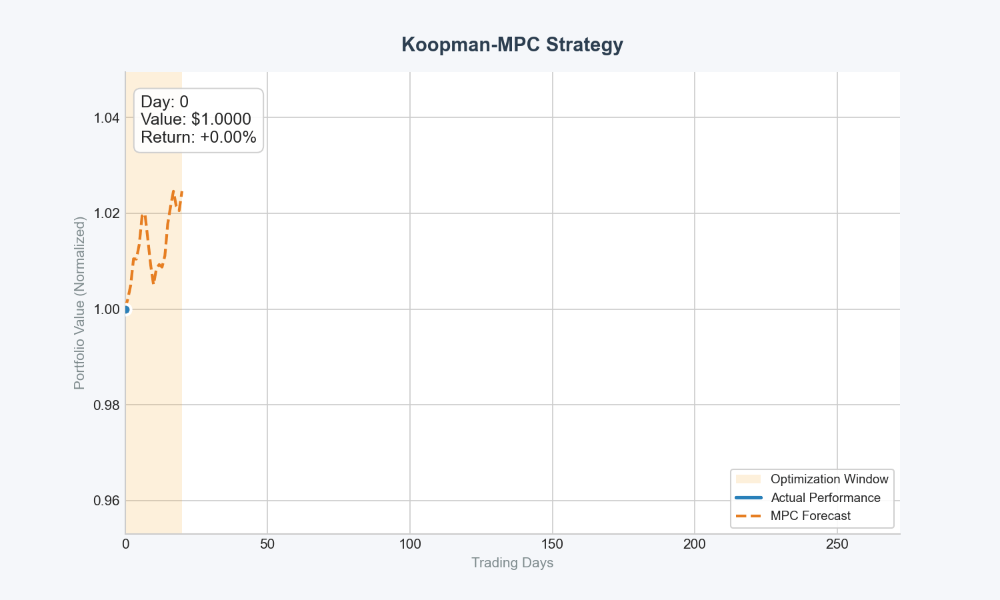

# Koopman-MPC Portfolio Rebalancing

Dynamic portfolio optimization using **Koopman Autoencoders (KAE)** and **Model Predictive Control (MPC)**. This project leverages the Koopman operator theory to linearize complex financial market dynamics in a high-dimensional latent space, enabling multi-step return forecasting and convex MPC-based portfolio optimization.


## Overview

Financial markets are notoriously non-linear. This repository implements a two-stage approach:
1.  **Forecasting of Market Dynamics (Koopman Autoencoder)**: A deep autoencoder learns a mapping from market observations to a latent space where the dynamics are governed by a linear operator (the Koopman operator).
2.  **Optimal Control (MPC)**: Given the linear dynamics in latent space, we use MPC to solve a multi-period portfolio optimization problem (Log-Utility or Mean-Variance) while accounting for transaction costs and turnover constraints.

## Features

-   **Koopman Autoencoder**: Learned linear representations of financial time series.
-   **Convex MPC Solver**: Multi-horizon optimization using `cvxpy`.
-   **Financial Baselines**: Comparative evaluation against:
    -   Buy & Hold
    -   Markowitz Mean-Variance (Static)
    -   DMD-MPC (Dynamic Mode Decomposition)
    -   VAR-MPC (Vector Autoregression)
-   **Flexible Objectives**: Support for Kelly Criterion (Log-Utility) and Mean-Variance optimization.
-   **Data Integration**: Built-in support for `yfinance` to fetch real-world equity data.

## Installation

This project uses `uv` for lightning-fast dependency management.

```bash
# Clone the repository
git clone https://github.com/yli421/koopman-mpc-portfolio-rebalancing.git
cd koopman-mpc-portfolio-rebalancing

# Install dependencies
uv sync
```

## Usage

### 1. Training the Koopman Model for Forecasting
Train the Koopman Autoencoder on historical financial data. We recommend using `template.sbatch` if you are on the Mila cluster since it contains all the hyperparameter settings we used for the reported results.

```bash
uv run python train.py --num_steps 5000 --batch_size 64
```

### 2. Running MPC Experiment against Baselines
Evaluate the trained model against baselines using the backtesting suite.

```bash
uv run python run_experiment.py --path runs/kae_finance/YOUR_TIMESTAMP_FOLDER
```
This script will:
- Load the best/last checkpoints.
- Run backtests for all strategies.
- Generate equity curve comparisons and metric tables (Sharpe Ratio, Returns, etc.).

### 3. Configuration
System settings and hyperparameters can be adjusted in `config.py` or passed via command-line arguments.

### 4. Testing
Run the test suite to ensure everything is working correctly.

```bash
uv run pytest
```

## Project Structure

-   `train.py`: Training pipeline for the Koopman Autoencoder.
-   `run_experiment.py`: Main entry point for backtesting and comparison.
-   `model.py`: PyTorch implementation of Koopman Autoencoder architectures.
-   `mpc.py`: Convex optimization logic for portfolio rebalancing.
-   `backtest.py`: Backtesting engine and performance metric calculations.
-   `baselines.py`: Implementation of standard financial strategies (Markowitz, DMD, VAR).
-   `data_finance.py`: Data loading, cleaning, and windowing for financial time series.
-   `config.py`: Configuration management and defaults.

## Results

The repository includes tools to visualize:
-   **Equity Curves**: Compare the cumulative wealth of Koopman-MPC vs. benchmarks.
-   **Prediction Accuracy**: Monitor MSE of multi-step market return forecasts.
-   **Portfolio Metrics**: Analyze Sharpe Ratio, Max Drawdown, and Turnover.

## License

This project is licensed under the MIT License - see the `LICENSE` file for details.